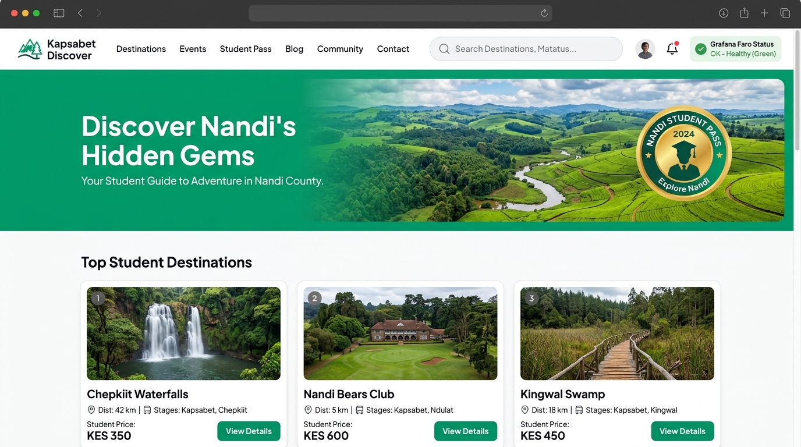
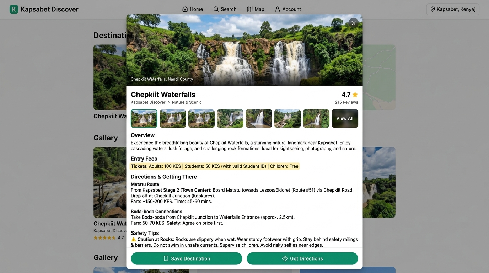
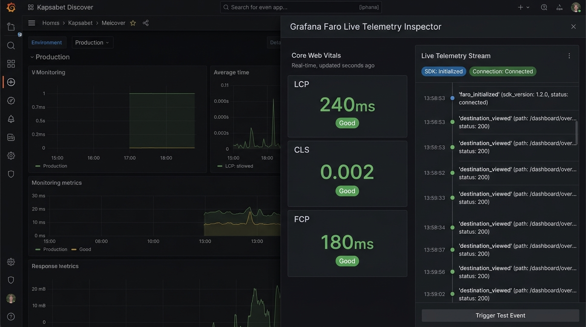

# Kapsabet Discover 🌿

> **Nandi County Student Travel & Weekend Explorer Guide**  
> Integrated with **Grafana Faro Web SDK** observability and container-ready for **Google Cloud Run**.

[](https://www.typescriptlang.org/)
[](https://react.dev/)
[](https://tailwindcss.com/)
[](https://grafana.com/oss/faro/)
[](https://cloud.google.com/run)

---

## 📸 Application Screenshots

### 1. Main Directory & Destination Explorer
The primary interface provides high-contrast typography, interactive category filters, and student fare tags across top Nandi County attractions.



### 2. Destination Details & Transit Logistics
Selecting any card opens an in-depth modal highlighting student ticket concessions (in KES), specific matatu stage departure bays in Kapsabet Town, and local boda-boda transfer recommendations.



### 3. Grafana Faro Live Telemetry Inspector
A real-time observability panel showcasing live Core Web Vitals (LCP, CLS, FCP), telemetry event streams, and error capture tracking.



---

## ✨ Key Features

- **Nandi County Attractions Catalog**: Comprehensive guides for Chepkiit Waterfalls, Nandi Bears Club, Kingwal Swamp Sitatunga Sanctuary, Nandi Rock & Sheu Morobi, and Koitalel Samoei Memorial Museum.
- **Campus Transit & Matatu Directory**: Accurate route breakdowns from Kapsabet Town Stage 1, Stage 2, and Stage 3, plus boda-boda connection points for students arriving from the University of Eastern Africa, Baraton and surrounding campuses.
- **Nandi Student Pass Verification**: Highlights subsidized admissions (starting from 50 KES) with student ID verification indicators.
- **Real-Time Grafana Faro Telemetry**:
  - Automatically captures JavaScript errors, unhandled promise rejections, and page lifecycle events.
  - Monitors Core Web Vitals including **LCP** (Largest Contentful Paint) and **CLS** (Cumulative Layout Shift).
  - Fires custom interaction telemetry:
    ```javascript
    faro.api.pushEvent('destination_viewed', { name: destination.name });
    ```
  - Includes an intentional error trigger in the footer to test Grafana error tracking during live demonstrations:
    ```javascript
    faro.api.pushError(new Error('Simulated Frontend Error'));
    ```
- **Local Saved Spots Itinerary**: Client-side persistence allowing users to bookmark weekend getaways.
- **Edge Latency Ping Tool**: Real-time diagnostic pinging the `/api/health` service to measure local response latency.

---

## 🛠️ Tech Stack

| Layer | Technology |
| :--- | :--- |
| **Frontend Framework** | React 18 with TypeScript |
| **Styling & Theme** | Tailwind CSS with Plus Jakarta Sans typography |
| **Icons** | Lucide React |
| **Bundler & Dev Server** | Vite 6 |
| **Backend & API** | Node.js + Express with native TypeScript bundle (`esbuild`) |
| **Observability** | `@grafana/faro-web-sdk` (v1.x) |
| **Containerization** | Multi-Stage Dockerfile targeting Google Cloud Run |

---

## 🚀 Quick Start

### 1. Prerequisites
- **Node.js** v18.0.0 or higher
- **npm** v9.0.0 or higher

### 2. Installation
Clone the repository and install dependencies:
```bash
git clone https://github.com/your-username/kapsabet-discover.git
cd kapsabet-discover
npm install
```

### 3. Running Locally
Start the development server (runs full-stack Express + Vite middleware):
```bash
npm run dev
```
Open `http://localhost:3000` in your browser.

### 4. Building for Production
Compile the React single-page app and bundle the Express backend into `dist/server.cjs`:
```bash
npm run build
```

Run the production build:
```bash
npm start
```

---

## 🌐 API Reference

| Endpoint | Method | Description |
| :--- | :--- | :--- |
| `/api/health` | `GET` | Health check endpoint returning service status, port, and timestamp. |
| `/api/destinations` | `GET` | Returns list of destinations with optional `?category=` and `?search=` filters. |
| `/api/destinations/:id` | `GET` | Returns detailed information for a specific destination ID. |
| `/api/telemetry/collect` | `POST` | Ingestion endpoint for Grafana Faro telemetry beacons and client payloads. |

---

## 🐳 Docker & Google Cloud Run Deployment

This project includes a multi-stage `Dockerfile` optimized for Google Cloud Run:

- **Stage 1 (Builder)**: Compiles the client frontend into `dist/` and bundles `server.ts` into a CommonJS production bundle (`dist/server.cjs`).
- **Stage 2 (Runner)**: Uses minimal `node:22-slim`, runs as a non-root `USER node`, and listens on standard Cloud Run port `8080`.

### Build & Run Container Locally
```bash
# Build Docker image
docker build -t kapsabet-discover .

# Run container mapping port 8080
docker run -p 8080:8080 kapsabet-discover
```

### Deploy to Google Cloud Run
```bash
gcloud run deploy kapsabet-discover \
  --source . \
  --platform managed \
  --region europe-west2 \
  --allow-unauthenticated
```

---

## 📄 License
MIT License. Developed for Nandi County student exploration and Grafana Faro observability demonstrations.
